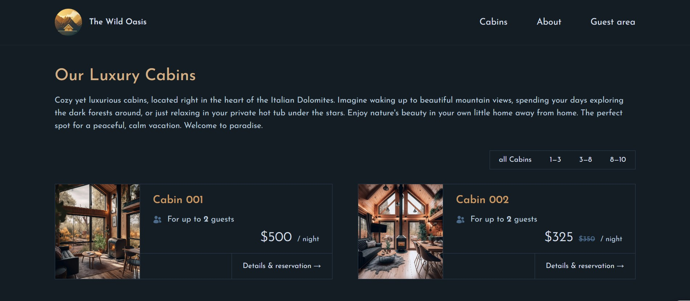

# Hotel

reservation a cabin in the hotel [see website](https://reservationhotel.vercel.app/)

## Description

This application allows users to book hotel cabins for specific dates, edit or delete their bookings, and manage their profiles. **Authentication** uses Google OAuth via NextAuth. Data is stored in Supabase (**Postgres**).

## Features

- Sign in with Google (OAuth)
- User profile management (nationality, national Id)
- View available cabins and booking calendar
- Create, edit, and delete bookings
- Date conflict checks to prevent overlapping bookings
- Responsive UI built with Tailwind CSS

## Teck Stack

- Next.js (App Router)
- React
- Supabase (Auth, Database, Storage)
- PostgreSQL (via Supabase)
- Tailwind CSS
- Vercel (recommended) or other hosting providers

## Quick Start (Local)

1. Clone the repository :

   `git clone https://github.com/Moein-Kazemi/hotel `

2. Change directory :
   `cd <project-folder>`

3. Install dependencies :
   `npm install`

4. Create a `.env.local` file (see Environment Variables below)

5. Run the development server:
   `npm run dev`
6. Open
   `http://localhost:3000`

after that you have to create a project in the Supabase and connect to your project in local machine

## Environment Variables

Example `.env.local` (do NOT commit secrets):

- SUPABASE_URL=`<your-supabase-url>`
- SUPABASE_KEY=`<your-supabase-anon-key>`
- NEXTAUTH_URL=`http://localhost:3000`
- NEXTAUTH_SECRET=`secret_key`

Security notes:

Never expose **SUPABASE_KEY** and **SUPABASE_URL** to the client.
Use **NEXT_PUBLIC** prefix only for values safe in the browser.

## Contributing

- Open issues for bugs or feature requests.
- Fork the repository, create a feature branch, run tests and linters, then open a pull request.
- Add or update documentation when changing APIs or database schemas.

## Status

project is online in the:
[reservationhotel](https://reservationhotel.vercel.app/)
